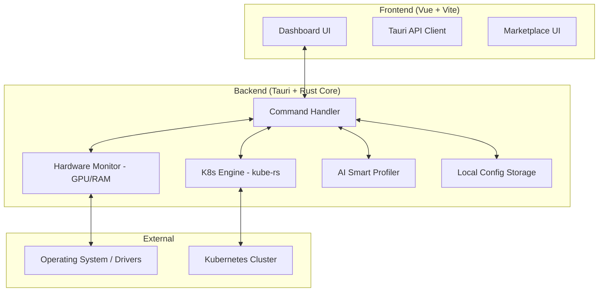

# System Architecture

## 🏗️ High-Level Overview
StreamK8s is designed as a bridge between the local operating system's hardware (specifically GPUs) and Kubernetes clusters. It operates as a desktop application that monitors resource demands from local applications and dynamically adjusts Kubernetes workloads to optimize performance.

## 🗺️ Component Diagram

## 🛠️ Technology Stack
- **Programming Languages:** 
  - **Rust (2021 Edition):** High-performance backend core and hardware interfacing.
  - **TypeScript:** Type-safe frontend logic and extension interfaces.
  - **HTML/CSS:** Responsive UI layout (Vue.js).
- **Tooling & Infrastructure:**
  - **Tauri v2:** Cross-platform desktop framework (Rust-based).
  - **Vue 3.5:** Reactive frontend framework with Vite as a build tool.
  - **Serde:** Efficient serialization/deserialization for data flow between Rust and TS.
  - **Tailwind CSS:** (If applicable) or Vanilla CSS for styling.
- **Core Pattern:** 
  - **KISS (Keep It Simple, Stupid):** Prioritize clear, maintainable code over complex abstractions.
  - **Command-Query Separation:** Clear distinction between hardware control and dashboard telemetry.
- **Strategy:** 
  - Disrupt the K8s IDE market by bridging DevOps tools with OS-level hardware management.
  - Focus on "Monkey-Proof" UI to lower the barrier for GPU-accelerated Kubernetes development.

## 🔗 Internal References
- Engineering rules: [PRINCIPLES.md](PRINCIPLES.md)
- Live project map: [STRUCTURE.tree](STRUCTURE.tree)
- Engineering Protocols: [GEMINI.md](GEMINI.md)
